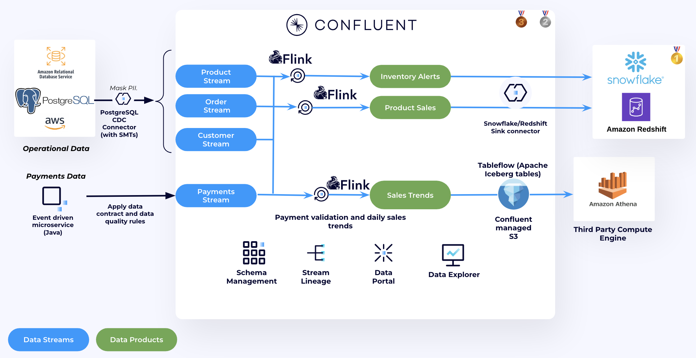

#  Online Retailer Stream Processing Demo using Confluent for Apache Flink

This repository showcases a demo for an online retailer that leverages Confluent Cloud to process sales orders in real-time, compute sales trends, and pre-process data for advanced analytics in Amazon Athena and a datawarehouse of your choice (Snowflake or Amazon Redshift).

It shows harness the power of a Data Streaming Platform (DSP) to clean and govern data at the time it is created, and deliver fresh trustworthy data to your data warehouse and data lake to maximize the ROI.

This demo showcases how an online retailer can leverage Confluent to implement real-time analytics across three critical use cases: ***Low Inventory Alerts***, ***Product Sales Analysis*** and ***Daily Sales Trend Analysis***. The solution demonstrates the power of real-time data streaming to enhance operational efficiency and decision-making. Below is the high-level architecture diagram:



You can choose to deploy the demo with with either Snowflake or Amazon Redshift. We use Terraform to deploy all the necessary resources. The script deploys the following:

1. Confluent Cloud Infrastructure components:
   1. Environment
   2. Cluster
   3. Topics and Schemas
   4. RBAC role-bindings
   5. Debezium CDC Connector and Data Qaulity Rules.
2. AWS Infrastructure components:
   1. Redshift Cluster
   > Note: only if Amazon Redshift is selected as a data warehouse
   2. Amazon RDS for PostgreSQL Database - holds information about Product, Orders and Customers
   3. AWS KMS Semmetric key - used for Client Side Field Level Encryption
   4. Two Amazon ECS Services
      * DB Feeder to populate Postgres DB
      * Payments Java Application
3. Snowflake Infrastructure components:
   > Note: only if Snowflake is selected as a data warehouse
   1. Database and Schema
   2. User with 2048 Public and Private key and the associated Role

```bash
├── Code                                  <-- Directory that holds demo code and dockerfile
│   ├── payments-app                      <-- Payments App code and dockerfile
│   ├── postgres-data-feeder              <-- DB Feeder code and dockerfile
├── terraform                             <-- Directory that holds terraform scripts
├── Usecase 1                             <-- Directory that holds usecase 1 instructions and screenshots
├── Usecase 2                             <-- Directory that holds usecase 2 instructions and screenshots
├── Usecase 3                             <-- Directory that holds usecase 3 instructions and screenshots
├── Usecase 4                             <-- Directory that holds usecase 4 instructions and screenshots
└── README.md
```

## Demo Video

This is a [video](https://www.confluent.io/resources/demo/shift-left-dsp-demo/) showcases how to run the demo. To deploy the demo follow this repo.


## General Requirements

* **Confluent Account** -  Sign-up to Confluent Cloud [here](https://confluent.cloud/signup).
* **Confluent Cloud API Keys** - [Cloud resource management API Keys](https://docs.confluent.io/cloud/current/security/authenticate/workload-identities/service-accounts/api-keys/overview.html#resource-scopes) with Organisation Admin permissions are needed by Terraform to deploy the necessary Confluent resources.
* **Terraform (v1.9.5+)** - The demo resources is automatically created using [Terraform](https://www.terraform.io). Besides having Terraform installed locally, will need to provide your cloud provider credentials so Terraform can create and manage the resources for you.
* **AWS account** - This demo runs on AWS
* **AWS CLI** - Terraform script uses AWS CLI to manage AWS resources
* **Docker** - Make sure is Docker installed and running locally. If not installed, follow [this](https://docs.docker.com/desktop/)
* **PSQL** - Make sure is psql is installed locally.
* **Unix machine** - The Terraform script requires a Unix environment. If you're using a Windows machine, consider deploying an EC2 instance with CentOS and run the deployment steps from there.
* [Optional] **Snowflake Account** -  Sign-up to Snowflake [here](https://signup.snowflake.com/).

## Setup

> Estimated time: 25 mins

1. Clone the repo onto your local development machine using `git clone https://github.com/rdeoliv/online-retailer-flink-demo`.
2. Change directory to demo repository and terraform directory.

```
cd online-retailer-flink-demo/terraform

```
3. Decide whether to deploy the demo with Redshift or Snowflake, then follow the corresponding instructions below.
   

<details>
<summary>Click to expand Amazon Redshift instructions</summary>

4. Update the ```terraform.tfvars``` file by setting the ```data_warehouse``` variable to ```"redshift"```. Remove any Snowflake-related variables from the file.
   >Note: The ```data_warehouse``` variable only accepts one of two values: ```"redshift"``` or ```"snowflake"```.
   
5. Run the following script to provision demo infrastructure

```
chmod +x ./demo-provision.sh
./demo-provision.sh
```

</details>

<details>
<summary>Click to expand Snowflake instructions</summary>

4. Update the ```terraform.tfvars``` file by setting:
   1. The ```data_warehouse``` variable to ```"snowflake"```.
      >Note: The ```data_warehouse``` variable only accepts one of two values: ```"redshift"``` or ```"snowflake"```.
   2. And Snowflake Variables:
      ```
      snowflake_account="<SNOWFLAKE_ACCOUNT_NUMBER>" #GET THIS FROM SNOWFLAKE Home Page --> Admin --> Accounts --> Copy the first part of the URL before .snowflake, it should look like this <organization_id-account_name>
      snowflake_username="<SNOWFLAKE_USENAME>"
      snowflake_password="<SNOWFLAKE_PASSWORD>"
      ```
   
5. Update the ```providers.tf``` file and Uncomment the following blocks at the end of the file:
   ```
   provider "snowflake" {
   alias = "snowflake"
   account  = var.data_warehouse == "snowflake" ? var.snowflake_account : "na"
   user     = var.data_warehouse == "snowflake" ? var.snowflake_username : "na"
   password = var.data_warehouse == "snowflake" ? var.snowflake_password : "na"
   }

   module "snowflake" {
   source = "./modules/snowflake"
   count  = var.data_warehouse == "snowflake" ? 1 : 0  # Only deploy module if Snowflake is selected
   providers = {
      snowflake = snowflake.snowflake
   }
   # Pass the variables required for Snowflake resources
   snowflake_account  = var.snowflake_account
   snowflake_username = var.snowflake_username
   snowflake_password = var.snowflake_password
   public_key_no_headers = local.public_key_no_headers
   }
   ```
6. Run the following script to provision demo infrastructure

```
chmod +x ./demo-provision.sh
./demo-provision.sh
```

</details>


>Note: The terraform script will take around 20 minutes to deploy.

## Demo
> Estimated time: 20 minutes

There are two options for demonstration.  One is to walk through 4 discrete technical use case demonstrations and the other is to walk through an end-to-end demonstration of "shifting left" which takes a more integrated approach.  For the shiftleft approach go [HERE](./Shiftleft/README.md).  Otherwise go to each of the use cases below individually.

In this demo we will implement 3 use cases and then at the end visualise everything we have built:
1. [Usecase 1 - Low inventory stock alerts](./Usecase1/USECASE1-README.md): Use Confluent Cloud for Apache Flink to process low inventory stock data and leverage the Snowflake/Redshift Sink Connector to stream the data into Snowflake or Redshift."
2. [Usecase 2 - Product Sales Aggregation](./Usecase2/USECASE2-README.md): Use Confluent Cloud for Apache Flink to clean and aggrgate Product Sales Data and sink the results to Snowflake or Redshift.
3. [Usecase 3 - Daily Sales Trends](./Usecase3/USECASE3-README.md): Use Confluent Cloud for Apache Flink for Payment Validation and compute daily sales trends. The results are stored in a topic that has Tableflow enabled - which materializes the topic as Iceberg data. We then use Amazon Athena for further Analysis.
4. [Usecase 4 - Managing Data Pipeines](./Usecase4/USECASE4-README.md): Use Confluent Cloud to manage and gain complete visibility into the entire data pipeline from a unified, single-pane view.

## Topics

**Next topic:** [Usecase 1: Low inventory stock alerts](./Usecase1/USECASE1-README.md)

## Clean-up
Once you are finished with this demo, remember to destroy the resources you created, to avoid incurring in charges. You can always spin it up again anytime you want.

Before tearing down the infrastructure, delete the Snowflake or Redshift connector, as it was created outside of Terraform and won't be automatically removed:

```
confluent connect cluster delete <CONNECTOR_ID> --cluster <CLUSTER_ID> --environment <ENVIRONMENT_ID> --force
```

To destroy all the resources created run the command below from the ```terraform``` directory:

```
chmod +x ./demo-destroy.sh
./demo-destroy.sh

```
> **Note: If you run terraform destroy instead of the provided shell script, the ECR repositories in AWS will not be deleted.**

