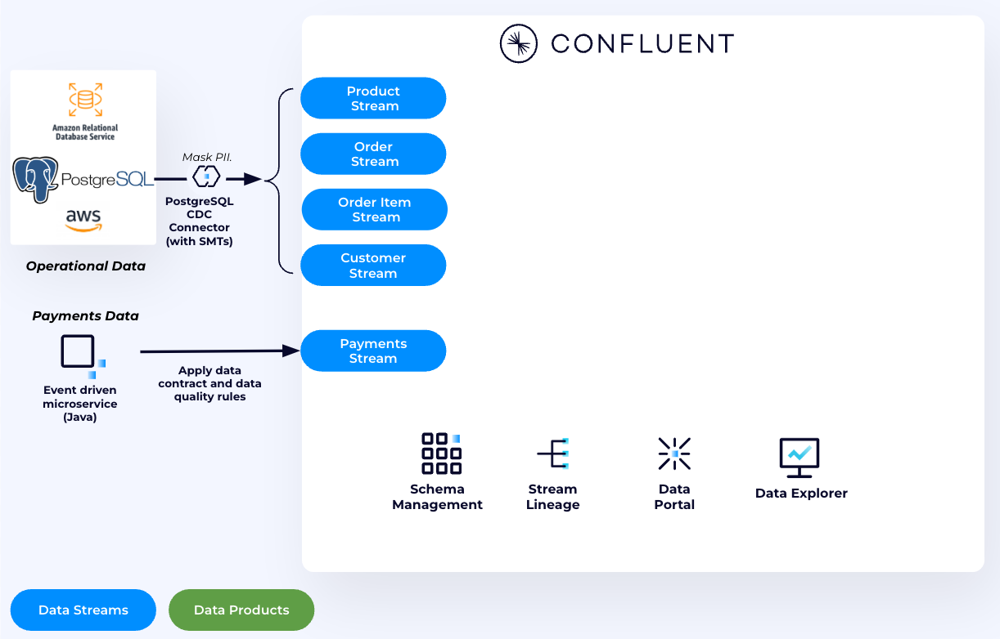
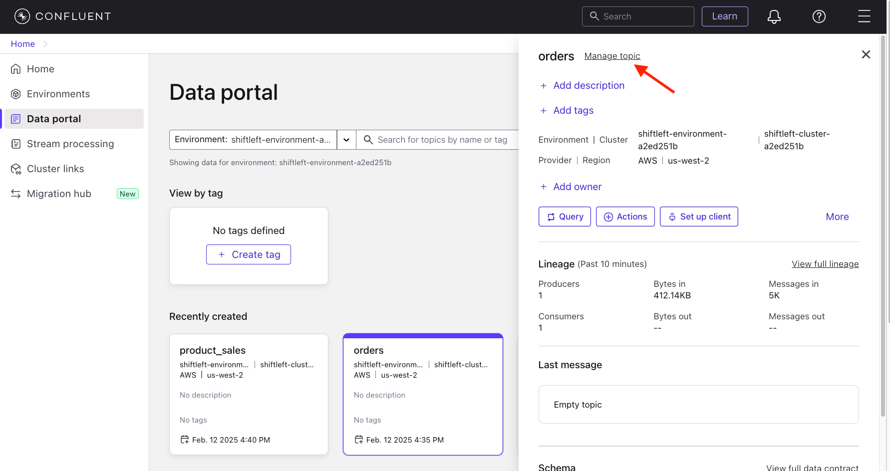
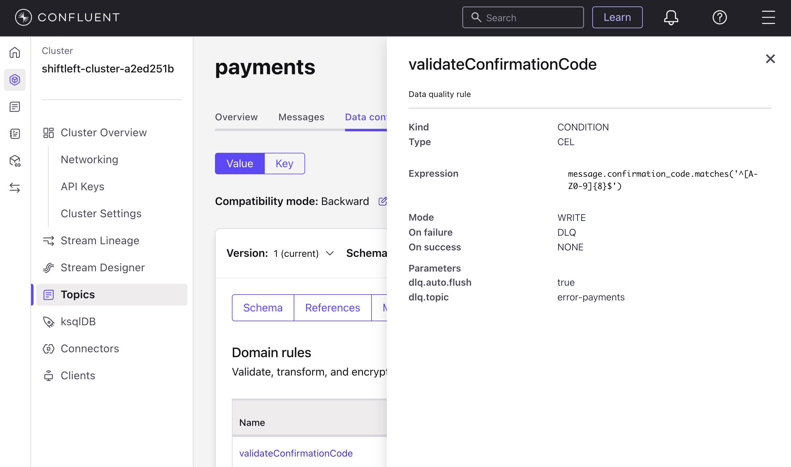
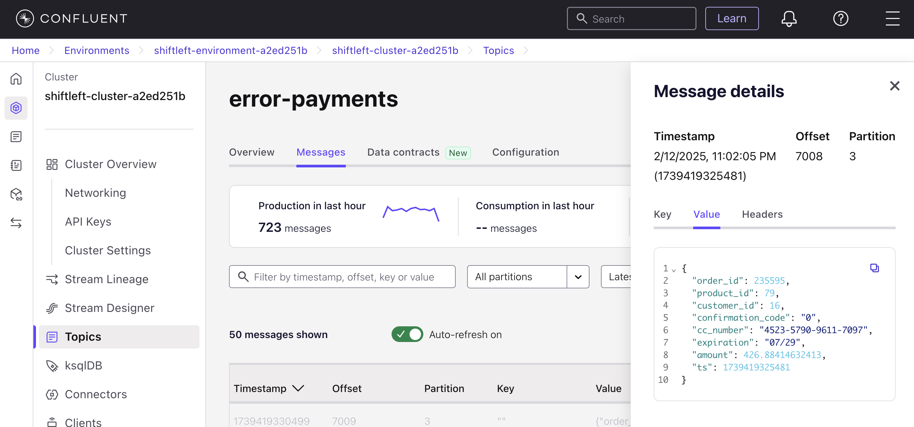
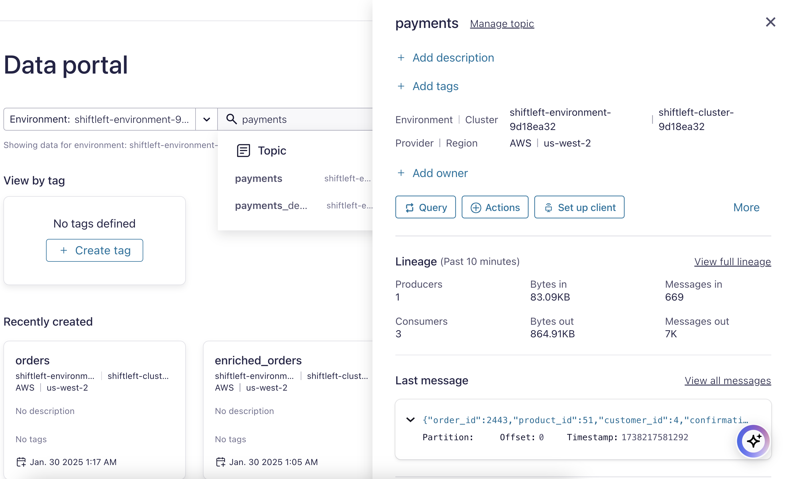
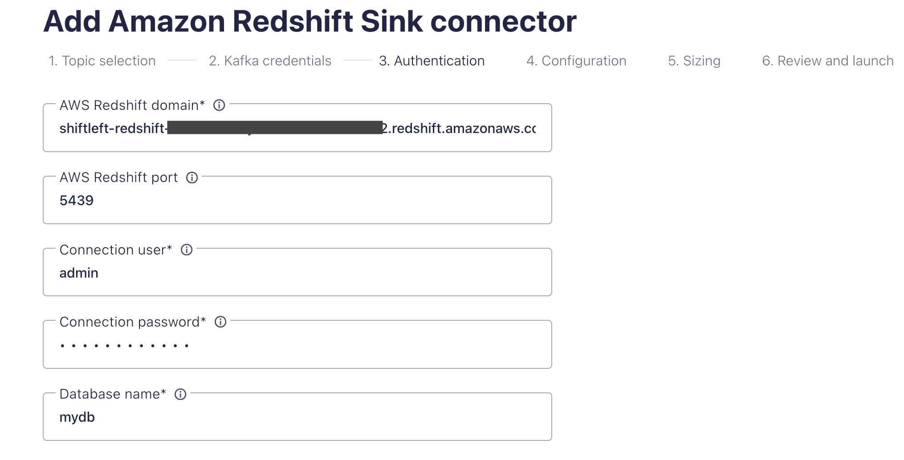
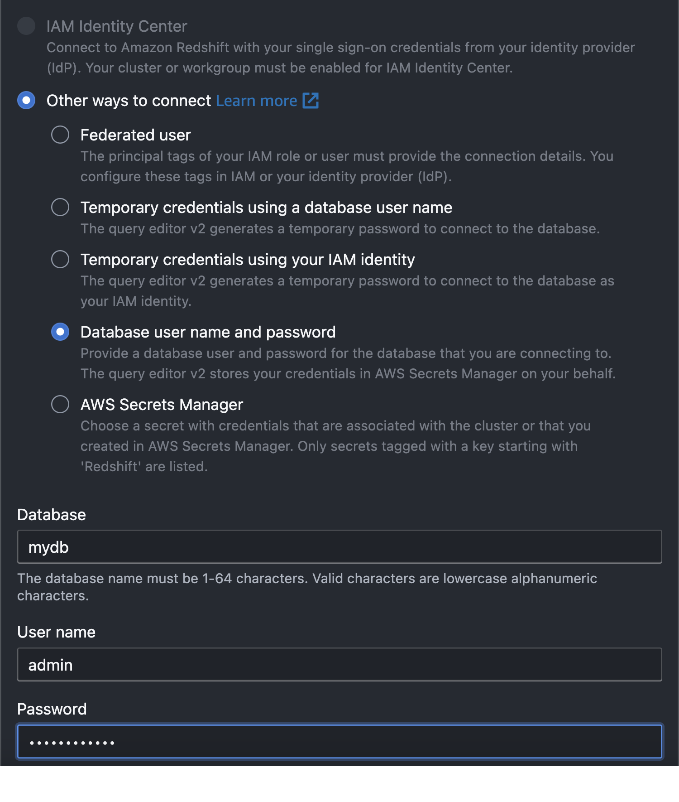
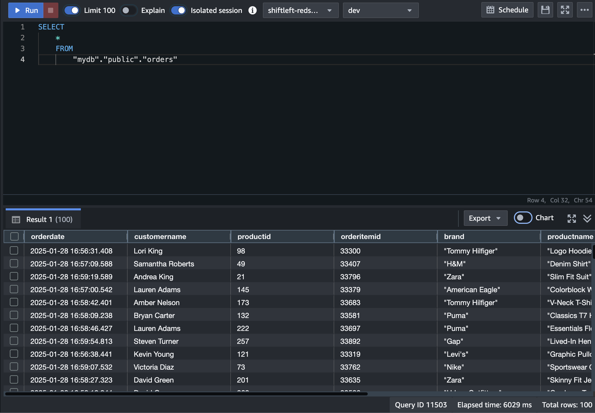
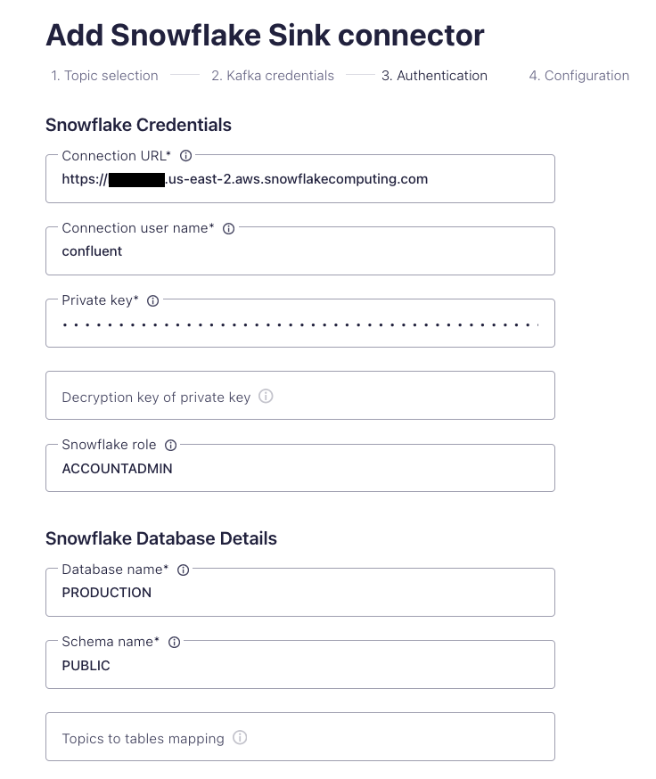
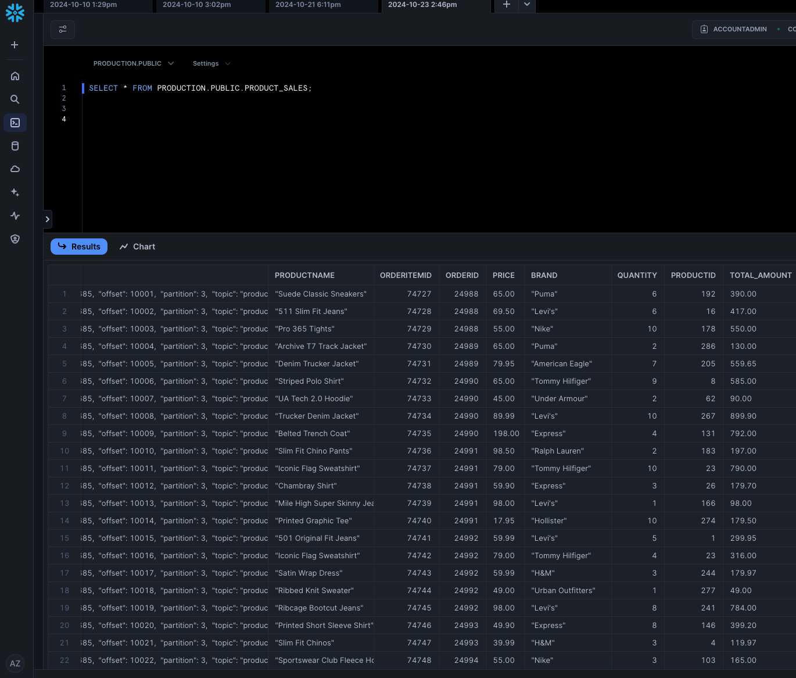

## Shift Left End to End Demonstration

This is an end-to-end demo walkthrough of shift left where we will be curating and enforcing data quality prior to it landing in downstream analytical technologies like lakehouses while also getting benefits in operational systems. This walk through does not depend on use cases 1-4 and is intended to be a self contained narrative.

### Scenario

The scenario is of a retailer moving from a legacy commerce system based on Postgres to an event driven architectural with MongoDB as the operational database.  They have already started building new customer experiencs on top of MongoDB.

Their entire stack is deployed on AWS and the analytics and AI team is making heavy use of Redshift.

They are facing  the following problems

- Duplicate records are landing in redshift
  - This is causing inaccurate reports and needs to be fixed
- They are also seeing bad payments data with seemingly invalid field values in redshift.
  - This isn’t causing any problems with the commerce site since they know how to handle defaults based on operational conditions
- PII needs to be protected and properly encrypted so only appropriate personnel and processes can access it
  - Within in the domain PII protection is happening but in order to share it with other analytics team it needs to be encrypted
- All these issue present the same problems for other potential consumers as well
  - A new machine learning model that acts in real-time for next best offer
  - Their new customer experience based on MongoDB
  - New fulfillment process that wants to be able to send goods directly from stores depending on a given scenario
- Each consumer could try and fix these problems separately but yeah... this is a bad idea

The following sources are coming into Confluent Cloud



- E-commerce site backed by Postgres
	- customers, products, orders, order item table data is captured through an off the shelf CDC (change data capture) connector.  
- Separately a payment processing service is emitting payment events upon successful completion of payments

### Walkthrough

1.  First lets take a look at the raw order data as it lands in Confluent kafka topics from the CDC connector.  Any data in Confluent cloud topics with a schema is automatically visible and usable from Flink and vice versa so we will start there.


    The data coming from Postgres is raw normalized table data.  In isolation, this raw orderstream doesn't mean much so every consumer who wants to use this data would need to understand the schema and join it with the other tables to make sense of it. Lets use Flink to make a enriched data product so this only needs to be done one time.

    ```
    SELECT * FROM `shiftleft.public.orders`
    ```  
   
   
    We need to join this with **order items**, **products**, and **customers** to have a complete picture of what a given order represents.

1.  As opposed to static snapshots in time, when joining streams of data you need to consider the temporal aspect and [tell Flink how to interpret the time of record](https://docs.confluent.io/cloud/current/flink/concepts/timely-stream-processing.html).  By default Confluent Cloud's Flink will use the Kafka record time but we want it to use the ```orderdate``` field which is when the order actually occurred in the source system.  We set that with the following SQL 

    ```SQL
    ALTER TABLE `<CONFLUENT_ENVIRONEMNT_NAME>`.`<CONFLUENT_CLUSTER_NAME>`.`shiftleft.public.orders` MODIFY WATERMARK FOR `orderdate` AS `orderdate`;
    ```

1.  To perform the join with the ```products``` stream [using the version of the product at the specific time of the order](https://docs.confluent.io/cloud/current/flink/reference/queries/joins.html#temporal-joins) we need to define a ```PRIMARY KEY```.  Lets create a new table that has a similar schema as ```products``` table but with a ```PRIMARY KEY``` constraint

    ```sql
    CREATE TABLE `products_with_pk` (
	   `productid` INT NOT NULL,
	   `brand` VARCHAR(2147483647) NOT NULL,
	   `productname` VARCHAR(2147483647) NOT NULL,
	   `category` VARCHAR(2147483647) NOT NULL,
	   `description` VARCHAR(2147483647),
	   `color` VARCHAR(2147483647),
	   `size` VARCHAR(2147483647),
	   `price` INT NOT NULL,
	   `__deleted` VARCHAR(2147483647),
	   PRIMARY KEY (`productid`) NOT ENFORCED
    );
    ```

    We will run a Flink statement to populate this new table with the primary key from the original product stream.

    ```sql
    SET 'client.statement-name' = 'products-with-pk-materializer';
    INSERT INTO `products_with_pk`
      SELECT  
        `productid`,
	     `brand`,
	     `productname`,
	     `category`,
	     `description`,
	     `color`,
	     `size`,
	     CAST(price AS INT) AS price,
	     `__deleted`
      FROM `shiftleft.public.products`;
    ```

1.  Ok lets now create a target Flink table produce the joined output of these 4 streams.  We will create the table for the new data product, set the watermark for the orderdate in this table, and perform the 4 way join.
    
    ```sql
    CREATE TABLE orders (
	   orderdate TIMESTAMP_LTZ(3) NOT NULL,
	   orderid INT NOT NULL,
	   customername STRING NOT NULL,
	   customerid INT NOT NULL,
	   productid INT NOT NULL,
	   orderitemid INT NOT NULL,
	   brand STRING NOT NULL,
	   productname STRING NOT NULL,
	   price INT NOT NULL,
	   quantity INT NOT NULL,
	   total_amount INT NOT NULL
    );
    ```
    ```sql
    ALTER TABLE `<CONFLUENT_ENVIRONEMNT_NAME>`.`<CONFLUENT_CLUSTER_NAME>`.`orders` MODIFY WATERMARK FOR `orderdate` AS `orderdate`;
    ```
    ```sql
    SET 'sql.state-ttl' = '7 DAYS';
    SET 'client.statement-name' = 'dp-orders-materializer';
    INSERT INTO orders 
    SELECT 
	   o.orderdate,
	   o.orderid,
	   cu.customername,
	   cu.customerid,
	   p.productid,
	   oi.orderitemid,
	   p.brand,
	   p.productname,
	   p.price, 
	   oi.quantity, 
	   oi.quantity * p.price AS total_amount 
    FROM 
	   `shiftleft.public.orders` o
    JOIN 
	   `shiftleft.public.order_items` oi ON oi.orderid = o.orderid
    JOIN 
	   `shiftleft.public.customers` cu ON o.customerid= cu.customerid
    JOIN 
	   `products_with_pk` FOR SYSTEM_TIME AS OF o.orderdate AS p ON p.productid = oi.productid
    WHERE 
	   p.productname <> '' 
	   AND p.price > 0;
    ```
    
1.  We now have a new orders table that is properly joind and enirched.  But if someone is looking for the correct orders data set how do they know which of the topics with "orders" in it is the right one?  To make this a data product we need to apply metadata and should ensure that it has a data contract that both describes (and enforces) schema and field data formatting.

    Navigate to the `orders` topic through the ***Data portal*** and click `Manage topic`.

    

    Add the tag `DataProduct`.  Since we don't have any DataProducts yet it will prompt you to create it.  Optionally you can give it a description and an owner.  You could also define and add arbitrary ***business metadata***

    Lets take a look at the `Data contracts`.  We have a schema, and the data contract itself does not have metadata associated with it.  In practice you would probaly want to embed the metadata we just manually added in the UI into the data contract directly and place it all under source control.
    
    Under `Rules` we currently don't have any but in practice for a data contract you would want to try and have a rich set of rules to ensure bad data does not end up in the data product AND the consumer understands exactly what they will be getting.  We will demonstrate an example with the `payments` data.
   
    Go back to the data portal and you can see that it shows up as a `DataProduct`

1.  Lets go examine the `payments` topic in the kafka cluster. Recall that in some cases it has been discovered that a payment goes through but when it lands in Redshift it has an invalid confirmation code.  If our business rule is that a payment is not considered to be a valid record outside of the domain without a valid confirmation then we should have a rule in the contract that enforces this.

    Go to `Data contract` and then click on the `Rules` tab.  You can see we aready have a rule to do this.
   
    Click on the `validateConfimrationCode`  You can see that rules stipulates that the field must exsit and be an 8 character long uppercase alphanumeric sequence.  If this is not the case the payment record will be dropped but written to a DLQ topic of error-payments.

    
    
    Examine the `error-payments`. You can see that messages in here are bad and have a `confirmation_code` of `0`.  More bad data we have stopped from landing in consumers

    

1.  The other issue with `payments` is that we sometimes have duplicates that are being emitted.  Lets demonstrate this to be the case.  lets go back to our Flink noteback and run the following

    ```sql
    SELECT * FROM 
      ( SELECT order_id, amount, count(*) total 
        FROM `payments`
        GROUP BY order_id, amount )
     WHERE total > 1;
    ```
    
    So lets dedupe this stream so that consumers don't get these.  Go to the data portal and click on the payments topic.  You will see there is a button called **Actions**

    

    Click on this and chose the **Deduplicate topic**.  Under **Fields to deduplicate** select `order_id`, `product_id`, and `amount`. Once you launch this ation behind the scenes it will generate and execute a flink statement.  In fact we can see what this looks like by scrolling to the buttom and selcting the **Show SQL** switch.  Naturally for a production system you would use sql that was checked into source control and use CI/CD etc. rather than launched an action from a production cluster for developing actions can be handy for giving you a starting point.  Click the **Confirm and run** button.

    If we now go back to Flink we can run the same query against the new topic ``payments_deduplicate``


1.  You may have noticed the credit card nummber is showing in clear text which isn't good so lets add a rule that encrypts all fields that are marked PII and mark the credit card field PII so that unencrypted PII doesn't land in redshift or anywhere else.

    In the `payments` Topic UI, select `Data Contracts` then click `Evolve`. Tag `cc_number` field as `PII`.

    Click **Rules** and then **Add rules** button. Configure as the following:
       * Category: `Data Encryption Rule`
       * Rule name: `Encrypt_PII`
       * Encrypt fields with: `PII`
       * using: The key added by Terraform (probably called CSFLE_Key)
  
       Then click **Add** and **Save**

       Our rule instructs the serailizer to ecrypt any field marked PII to be encrypted before being written into this topic

       

    Restart the ECS Service where the payments services is running for the changes to take effect immediately. Run ```terraform output``` to get the ECS command that should be used to restart the service. The command should look like this:
    ```
       aws ecs update-service --cluster <ECS_CLUSTER_NAME> --service payment-app-service --force-new-deployment
    ```
    
    It will take a 30 seconds to a minute to roll the payment java prducer app so lets go to the next step and we will come back to observe the encrypted fild Go back to the `payments` topic UI, you can see that the Credit number is now encrypted. 

    


1.  Data consumers aren't just looking for raw payments data.  What they really want is sales data and so we will join the payments with the orders to produce this.  In reality we would probably enrich this further with things like product names, etc.

    ```sql
    CREATE TABLE sales (
      order_id INT,
      brand STRING,
      productname STRING,
      amount DOUBLE,
      confirmation_code STRING,
      ts TIMESTAMP_LTZ(3),
      WATERMARK FOR ts AS ts - INTERVAL '5' SECOND
    );
    ```

    ```sql
    SET 'client.statement-name' = 'sales-materializer';
    INSERT INTO sales
    SELECT 
      pymt.order_id,
      ord.brand,
      ord.productname,
      pymt.amount, 
      pymt.confirmation_code, 
      pymt.ts
    FROM payments pymt, `orders` ord 
    WHERE pymt.order_id = ord.orderid
    AND orderdate BETWEEN pymt.ts - INTERVAL '96' HOUR AND pymt.ts;
    ```

    And we should tag this as a ```DataProduct``` as well

1.  Let's ingest our data product topics to the data wharehouse you have.

    <details> 
      <summary>Click to expand Amazon Redshift instructions</summary>

      We will sink data to Amazon Redshift using the Confluent Cloud Redshift Sink Connector. 

      1. In the [Connectors UI](https://confluent.cloud/go/connectors), add a new Redshift Sink Connector.
      2. Choose ```orders``` and ```sales``` topic and click **Continue**
      3. Enter Confluent Cluster credentials, you can use API keys generated by Terraform by running ```terraform output resource-ids``` you will find the API Keys in a section that looks like this:
   
         ```
         Service Accounts and their Kafka API Keys (API Keys inherit the permissions granted to the owner):
           shiftleft-app-manager-d217a8e3:                     sa-*****
           shiftleft-app-manager-d217a8e3's Kafka API Key:     "SYAKE*****"
           shiftleft-app-manager-d217a8e3's Kafka API Secret:  "rn7Y392xM49c******"
         ```
      4. Enter Redshift details
         1.  **AWS Redshift Domian**: Get it by running ```terraform output redshift-output```
         2.  **Connection user**: ```admin```
         3.  **Connection password**: ```Admin123456!```
         4.  **Database name**: ```mydb```
    
         

         >**NOTE: It's not recommended to use ADMIN user for data ingestion. We are using it here for demo purposes only.**


      5. Choose:
        * ```AVRO``` as **Input Kafka record value format**.
        *  Set **Auto create table** to `True`.
        *  Then follow the the wizard to create the connector.
  
      6. In the [Amazon Redshift Query V2 Editor page](https://console.aws.amazon.com/sqlworkbench/home), select the Cluster 
         and enter the connection parameters to establish a connection with the database.
   
         
   
      7.  Run the follwing SQL Statement to preview the new table.
          > Note: The connector will take less than a minute to run, **but the data will be available for querying in Snowflake after 3-5 minutes.**
    
          ```sql
            SELECT
            *
            FROM
                "mydb"."public"."orders";
          ```

          

    </details>

    <details>
    <summary>Click to expand Snowflake instructions</summary>

      We will sink data to Snowflake using the Confluent Cloud Snowflake Sink Connector. 

      1. In the [Connectors UI](https://confluent.cloud/go/connectors), add a new Snowflake Sink Connector.
      2. Choose `orders` and ```sales``` topic and click **Continue**
      3. Enter Confluent Cluster credentials, you can use API Keys generated by Terraform. By tunning ```terraform output resource-ids``` you will find the API Keys in a section that looks like this:
         ```
         Service Accounts and their Kafka API Keys (API Keys inherit the permissions granted to the owner):
            shiftleft-app-manager-d217a8e3:                     sa-*****
            shiftleft-app-manager-d217a8e3's Kafka API Key:     "SYAKE*****"
            shiftleft-app-manager-d217a8e3's Kafka API Secret:  "rn7Y392xM49c******"
         ```
      4. Enter Snowflake details
         1.  **Snowflake locator URL**: Get it under Admin --> Accounts in (Snowflake Console)[https://app.snowflake.com/]. It should look like this: *https://<snowflake_locator>.<cloud_region>.aws.snowflakecomputing.com*
         2.  **Connection username**: ```confluent```
         3.  **Private Key**: In CMD run ```terraform output resource-ids``` and copy the PrivateKey from there.
         4.  **Snowflake role**: `ACCOUNTADMIN`
         5.  **Database name**: ```PRODUCTION```
         6.  **Schema name**: ```PUBLIC```
    
             

         >**NOTE: It's not recommended to use ACCOUNTADMIN role for data ingestion. We are using it here for demo purposes only.**


     5. Choose:
        * ```AVRO``` as **Input Kafka record value format**.
        *  ```SNOWPIPE_STREMAING``` as **Snowflake Connection**.
        *  Set **Enable Schemitization** to `True`. Doing this will allow the connector to infer schema from Schema registry and write the data to Snowflake with the correct schema. 
        *  Then follow the the wizard to create the connector.
  
    

     6. In Snowflake UI, go to Worksheets and run the follwing SQL Statement to preview the new table.
        > Note: The connector will take less than a minute to run, **but the data will be available for querying in Snowflake after 3-5 minutes.**
        ``` sql
        SELECT * FROM PRODUCTION.PUBLIC.LOW_STOCK_ALERTS
        ```

        

    </details>

1.  Optionally lets look at some pre-aggregation and analysis that can be done continuously in Flink and then sent into the lakehouse.

    That detailed level of sales data can no doubt be valuable in a lakehouse, but if they want to look at revenue from a temporal perspective one thing that can be done very effectively is to compute temporal aggregates on a continuous basis in flink rather then in batches. Regardless of it being computed in Flink you still probably want that to flow to you lakehouse for further analytiss.  Lets compute our sales revenue on a minute basis

     ```sql
      CREATE TABLE incremental_revenue (
        window_start TIMESTAMP(3) NOT NULL,
        window_end TIMESTAMP(3) NOT NULL,
        total_revenue DECIMAL NOT NULL
      );
    ```
    
    ```sql
     SET 'client.statement-name' = 'revenue-summary-materializer';
     INSERT INTO incremental_revenue
         SELECT 
           window_start, 
           window_end, 
           SUM(amount) AS total_revenue
         FROM 
            TABLE(
              TUMBLE(TABLE sales, DESCRIPTOR(`ts`), INTERVAL '10' SECONDS)
            )
        GROUP BY 
          window_start, 
          window_end;
    ```

    Continuously computed calculations and aggregations can easily trigger immediate action based upon threashold.  One can easily imagine that if the inventory at a certain location falls below a certain threashold or is trending a certain way that alert would automatically trigger a supply request.
    
