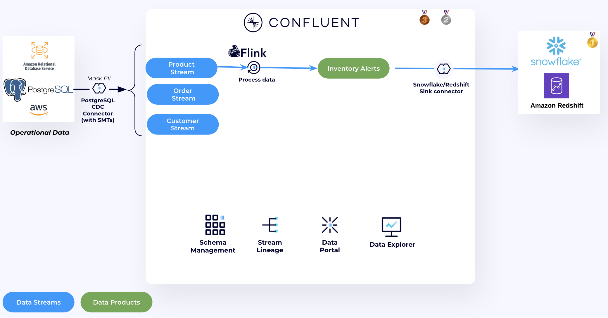
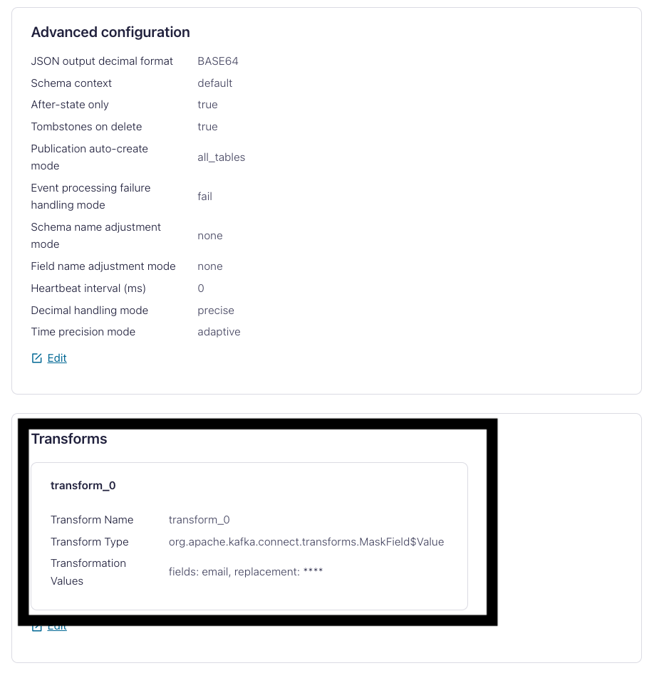
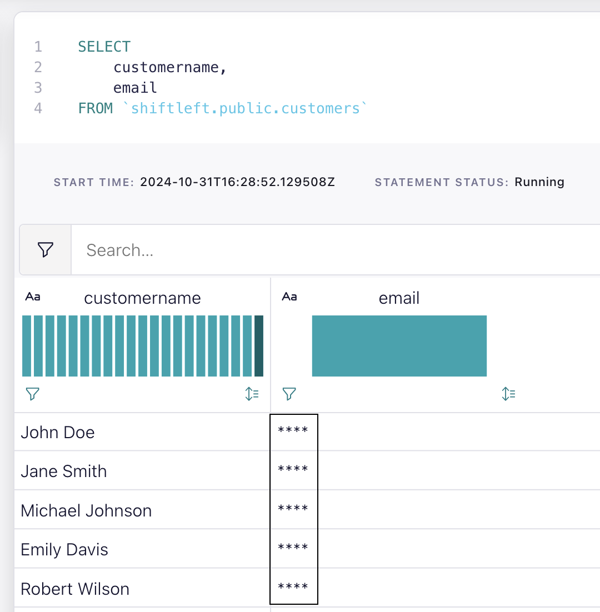
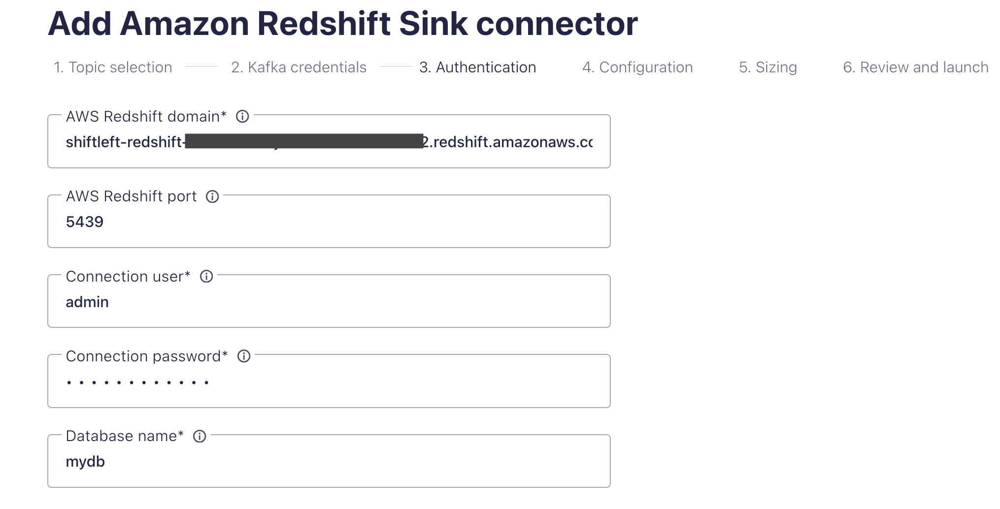
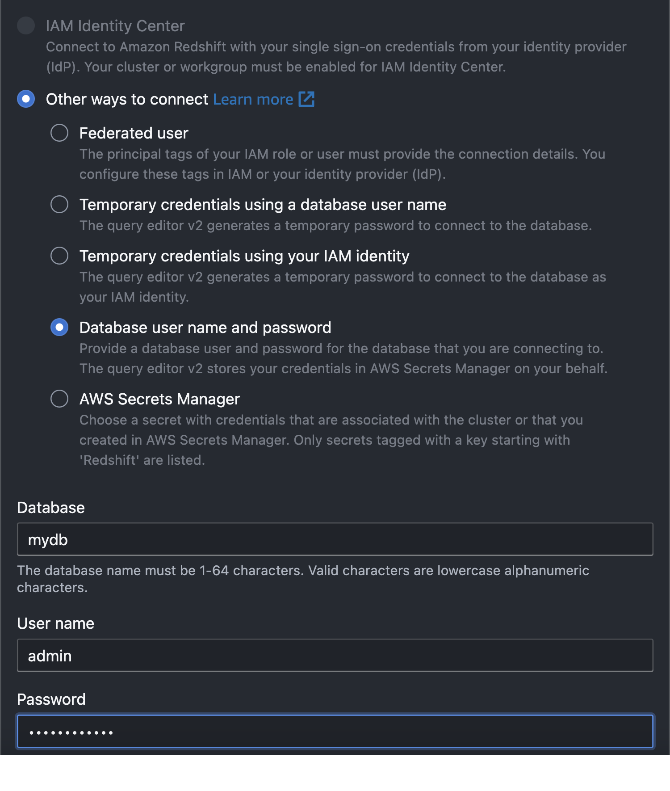
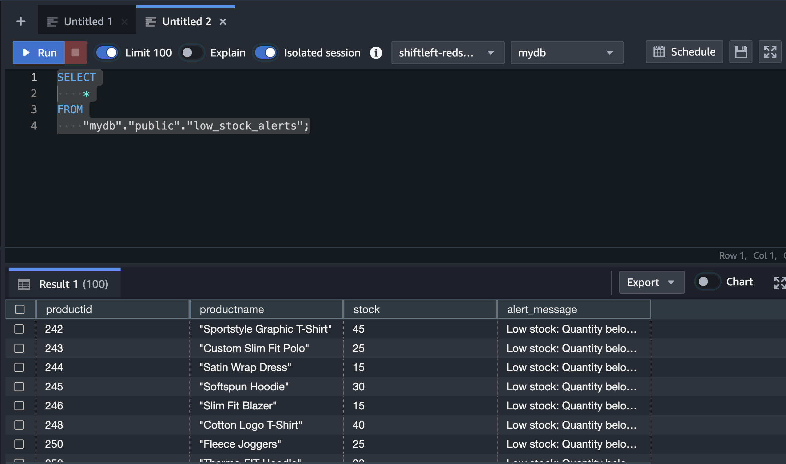
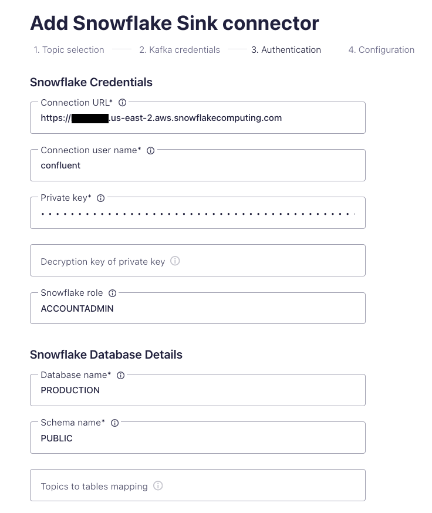
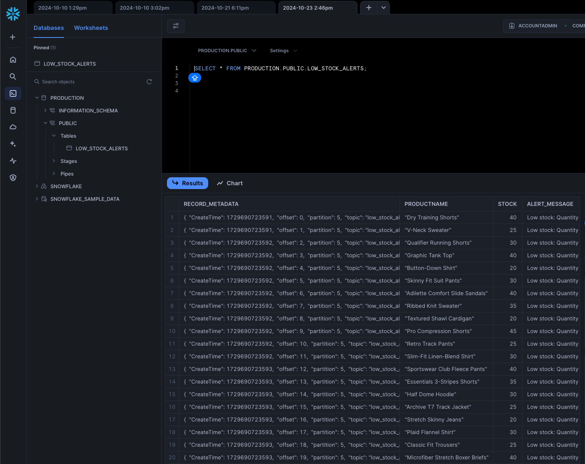

## Low inventory stock alerts




1. We are using Confluent Cloud CDC Debezium connector to source data from the Postgres DB to Confluent Cloud. Navigate to [Connectors UI](https://confluent.cloud/go/connectors) in Confluent Cloud and select the demo environment and cluster. They both have the same prefix, by defualt they start with ```shiftleft```.
2. Click on the Connector then **Settings**. Under transforms you will find the SMT used to mask PII information before sending the data to Confluent Cloud. This SMT replaces to email field value with ```****```.
   
   Now data should be flowing into Confluent Cloud.
3. Navigate to [Flink UI](https://confluent.cloud/go/flink) in Confluent Cloud and select the demo environment
4. Click on **Open SQL Workspace**.
5. On the top right corner of your workspace select the cluster as your database.
6. You will use the code editor to query existing Flink tables (Kafka topics) and to write new queries.
7. In Confluent Cloud, each topic is represented as a table within the Apache Flink catalog. When you create a table in Apache Flink, a corresponding topic and schema are automatically generated to back the table.

   ```
   SHOW TABLES;
   ```
8. First, let's make sure that the connector SMT is working and that it is masking the `email` field value:

    ```
    SELECT
        customername,
        email
    FROM
        `shiftleft.public.customers`
    ```
   
9. Create ```low_stock_alerts``` table.
    ```
    CREATE TABLE low_stock_alerts (
        productid INT,
        productname STRING,
        stock INT,
        alert_message STRING
    ); 
    ```
10. Run the Apache Flink SQL Statement below to find out low quantity stocks
    ```
        SELECT
            productid,
            productname,
            stock,
            'Low stock: Quantity below 50!' AS alert_message
        FROM
            `shiftleft.public.products`
        WHERE
            stock < 50;

    ```
11. The output will run continously run until terminated, to materialiaze the data into the output topic we need to use ``` INSERT INTO SELECT ```.
    ```
    SET 'client.statement-name' = 'low-stock-alerts-materializer';
    INSERT INTO low_stock_alerts
        SELECT
            productid,
            productname,
            stock,
            'Low stock: Quantity below 50!' AS alert_message
        FROM
            `shiftleft.public.products`
        WHERE
            stock < 50;

    ```

12. The output table is a Kafka topic with an avro schema that holds stocks that are below 50 in the inventory. 
13. Now let's ingest data from ```low_stock_alerts``` topic to the data wharehouse you have.

<details>
<summary>Click to expand Amazon Redshift instructions</summary>

We will sink data to Amazon Redshift using the Confluent Cloud Redshift Sink Connector. 

1. In the [Connectors UI](https://confluent.cloud/go/connectors), add a new Redshift Sink Connector.
2. Choose ```low_stock_alerts``` topic and click **Continue**
3.   Enter Confluent Cluster credentials, you can use API Keys generated by Terraform
     1.   In CMD run ```terraform output resource-ids``` you will find the API Keys in a section that looks like this:
   
        ```
            Service Accounts and their Kafka API Keys (API Keys inherit the permissions granted to the owner):
                shiftleft-app-manager-d217a8e3:                     sa-*****
                shiftleft-app-manager-d217a8e3's Kafka API Key:     "SYAKE*****"
                shiftleft-app-manager-d217a8e3's Kafka API Secret:  "rn7Y392xM49c******"
        ```
4.  Enter Redshift details
    1.  **AWS Redshift Domian**: Get it by running ```terraform output redshift-output```
    2.  **Connection user**: ```admin```
    3.  **Connection password**: ```Admin123456!```
    4.  **Database name**: ```mydb```
    
    

    >**NOTE: It's not recommended to use ADMIN user for data ingestion. We are using it here for demo purposes only.**


5.  Choose:
    * ```AVRO``` as **Input Kafka record value format**.
    *  Set **Auto create table** to `True`.
    *  Then follow the the wizard to create the connector.
  
6.  In the [Amazon Redshift Query V2 Editor page](https://console.aws.amazon.com/sqlworkbench/home), select the Cluster and enter the connection parameters to establish a connection with the database.
   
    
   
7.   Run the follwing SQL Statement to preview the new table.
        > Note: The connector will take less than a minute to run, **but the data will be available for querying in Snowflake after 3-5 minutes.**
    
        ```
            SELECT
            *
            FROM
                "mydb"."public"."low_stock_alerts";
        ```

        

</details>


<details>
<summary>Click to expand Snowflake instructions</summary>

We will sink data to Snowflake using the Confluent Cloud Snowflake Sink Connector. 

1. In the [Connectors UI](https://confluent.cloud/go/connectors), add a new Snowflake Sink Connector.
2. Choose ```low_stock_alerts``` topic and click **Continue**
3. Enter Confluent Cluster credentials, you can use API Keys generated by Terraform
     1.   In CMD run ```terraform output resource-ids``` you will find the API Keys in a section that looks like this:
            ```
                Service Accounts and their Kafka API Keys (API Keys inherit the permissions granted to the owner):
                    shiftleft-app-manager-d217a8e3:                     sa-*****
                    shiftleft-app-manager-d217a8e3's Kafka API Key:     "SYAKE*****"
                    shiftleft-app-manager-d217a8e3's Kafka API Secret:  "rn7Y392xM49c******"
            ```
4.  Enter Snowflake details
    1.  **Snowflake locator URL**: Get it under Admin --> Accounts in (Snowflake Console)[https://app.snowflake.com/]. It should look like this: *https://<snowflake_locator>.<cloud_region>.aws.snowflakecomputing.com*
    2.  **Connection username**: ```confluent```
    3.  **Private Key**: In CMD run ```terraform output resource-ids``` and copy the PrivateKey from there.
    4.  **Snowflake role**: `ACCOUNTADMIN`
    5.  **Database name**: ```PRODUCTION```
    6.  **Schema name**: ```PUBLIC```
    
    

    >**NOTE: It's not recommended to use ACCOUNTADMIN role for data ingestion. We are using it here for demo purposes only.**


18. Choose:
    * ```AVRO``` as **Input Kafka record value format**.
    *  ```SNOWPIPE_STREMAING``` as **Snowflake Connection**.
    *  Set **Enable Schemitization** to `True`. Doing this will allow the connector to infer schema from Schema registry and write the data to Snowflake with the correct schema. 
    *  Then follow the the wizard to create the connector.
  
    

18. In Snowflake UI, go to Worksheets and run the follwing SQL Statement to preview the new table.
    > Note: The connector will take less than a minute to run, **but the data will be available for querying in Snowflake after 3-5 minutes.**
    ```
    SELECT * FROM PRODUCTION.PUBLIC.LOW_STOCK_ALERTS
    ```
    

</details>

## Topics

**Next topic:** [Usecase 2 - Product Sales Aggregation](../Usecase2/USECASE2-README.md)

**Previous topic:** [Demo Introduction and Setup](../README.md)


