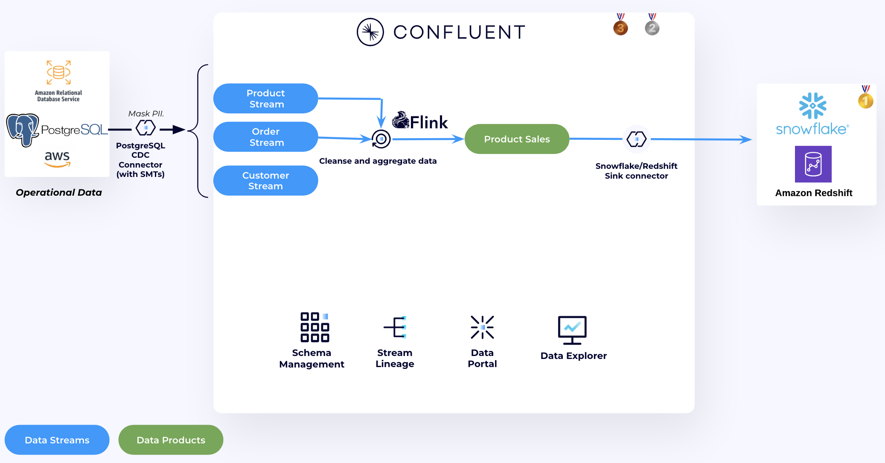
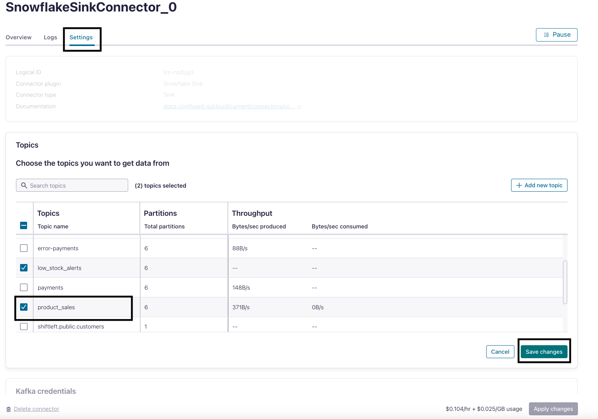
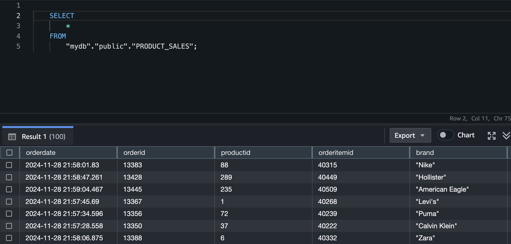
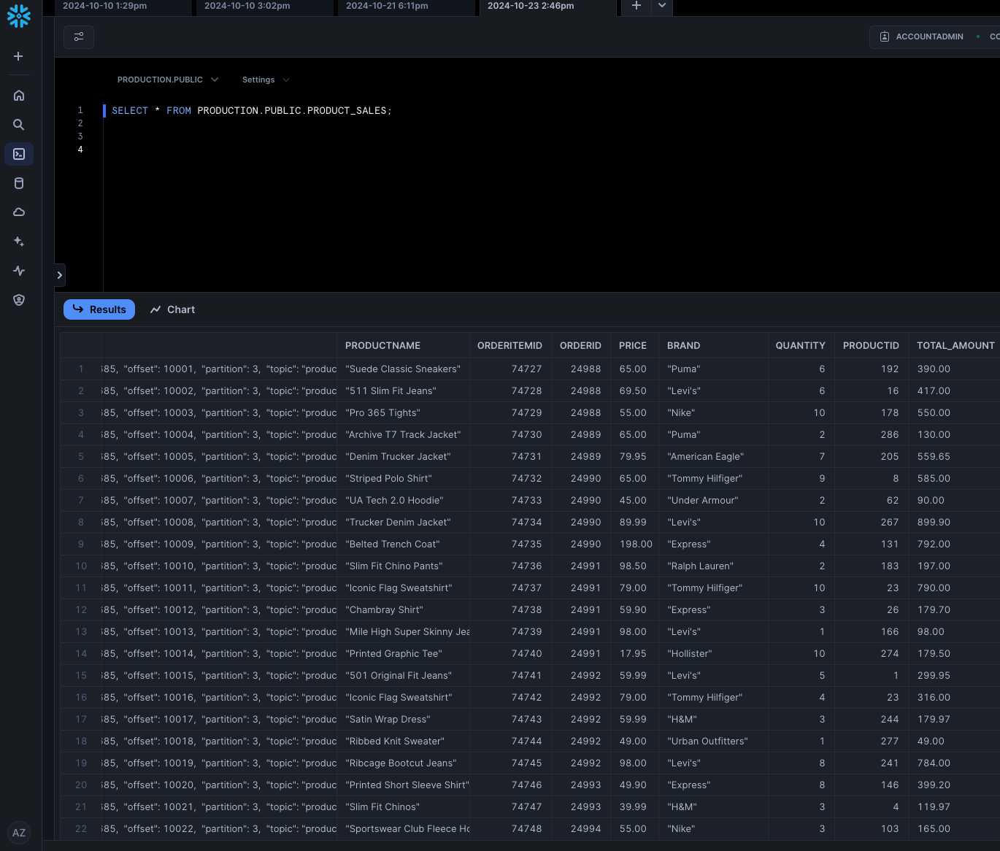

## Product Sales Aggregation
In this usecase we will create a new Data Product ```Product_Sales``` by joining, cleaning and aggregating three tables—`products`, `order_items`, and `orders`—to generate a detailed view of orders and their associated products.

 


1. Flink jobs can measure time using either the system clock (processing time), or timestamps in the events (event time). For the ```orders``` table, notice that each order has ```orderdate```, this is a timestamp for each order created. 
   
   ```
    SHOW CREATE TABLE `shiftleft.public.orders`;
   ```
2. We want to set the ```orderdate``` field as the event time for the table, enabling Flink to use it for accurate time-based processing and watermarking:

    ```
    ALTER TABLE `<CONFLUENT_ENVIRONEMNT_NAME>`.`<CONFLUENT_CLUSTER_NAME>`.`shiftleft.public.orders` MODIFY WATERMARK FOR `orderdate` AS `orderdate`;
    ```

3. To perform a temporal join with ```products``` table, the ```products``` table needs to have a ```PRIMARY KEY```. Which is not defined at the moment. Create a new table that has the same schema as ```products``` table but with a PRIMARY KEY constraint

    ```
    CREATE TABLE `products_with_pk` (
        `productid` INT NOT NULL,
        `brand` VARCHAR(2147483647) NOT NULL,
        `productname` VARCHAR(2147483647) NOT NULL,
        `category` VARCHAR(2147483647) NOT NULL,
        `description` VARCHAR(2147483647),
        `color` VARCHAR(2147483647),
        `size` VARCHAR(2147483647),
        `price` INT NOT NULL,
        `__deleted` VARCHAR(2147483647),
        PRIMARY KEY (`productid`) NOT ENFORCED
    );
    ```

    ```
    SET 'client.statement-name' = 'products-with-pk-materializer';
    INSERT INTO `products_with_pk`
    SELECT  `productid`,
        `brand`,
        `productname`,
        `category`,
        `description`,
        `color`,
        `size`,
        CAST(price AS INT) AS price,
        `__deleted`
    FROM `shiftleft.public.products`;
    ```

4. Join the tables together to provide insights into each order's contents, including the product details, brand, quantity purchased, and the total amount for each order item. The query applies filters to ensure only valid products with non-empty names and positive prices are included in the result set.

    This analysis is useful for understanding product sales trends, calculating revenue, and generating reports on order compositions.


   Create a new Apache Flink table ```product_sales``` to represent the new data product.
   
   ```
   CREATE TABLE product_sales (
        orderdate TIMESTAMP_LTZ(3),
        orderid INT,
        productid INT,
        orderitemid INT,
        brand STRING,
        productname STRING,
        price INT,
        quantity INT,
        total_amount INT
    );
   ```
   Continuously insert the join results into the table
   ```
    SET 'sql.state-ttl' = '7 DAYS';
    SET 'client.statement-name' = 'product-sales-materializer';
    INSERT INTO product_sales 
    SELECT 
        o.orderdate,
        o.orderid,
        p.productid,
        oi.orderitemid,
        p.brand,
        p.productname,
        p.price, 
        oi.quantity, 
        oi.quantity * p.price AS total_amount 
    FROM 
        `shiftleft.public.orders` o
    JOIN 
        `shiftleft.public.order_items` oi ON oi.orderid = o.orderid
    JOIN 
        `products_with_pk` FOR SYSTEM_TIME AS OF o.orderdate AS p ON p.productid = oi.productid
    WHERE 
        p.productname <> '' 
        AND p.price > 0;

   ```
    The join uses the ```FOR SYSTEM_TIME AS OF``` keyword, making it a temporal join. Temporal joins are more efficient than regular joins because they use the time-based nature of the data, enriching each order with product information available at the order's creation time. If product details change later, the join result remains unchanged, reflecting the original order context. Additionally, temporal joins are preferable as regular joins would require Flink to keep the state indefinitely.

5. Now let's sink the new data product to our data warehourse. Update the same Connector and add the new topic `product_sales`. Here is an example of the Snoflake connector, do the same if you are using Redshift. After adding the topic, click **Save changes** then **Apply changes**.
   
   


<details>
<summary>Query from Redshift</summary>

1. In the [Amazon Redshift Query V2 Editor page](console.aws.amazon.com/sqlworkbench/home), run the follwing SQL Statement to preview the new table.
    ```
    
    SELECT
        *
    FROM
        "mydb"."public"."PRODUCT_SALES";

    ```
     

</details>


<details>
<summary>Query from Snowflake </summary>

1. In Snowflake UI, go to Worksheets and run the follwing SQL Statement to preview the new table.
    ```
    SELECT * FROM PRODUCTION.PUBLIC.PRODUCT_SALES
    ```
     

</details>

## Topics

**Next topic:** [Usecase 3 - Daily Sales Trends](../Usecase3/USECASE3-README.md)

**Previous topic:** [Usecase 1: Low inventory stock alerts](../Usecase1/USECASE1-README.md)