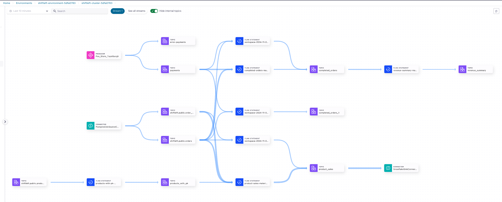
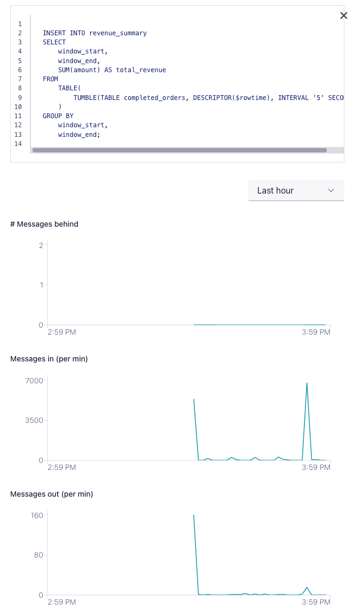
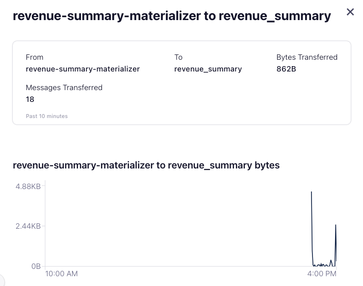
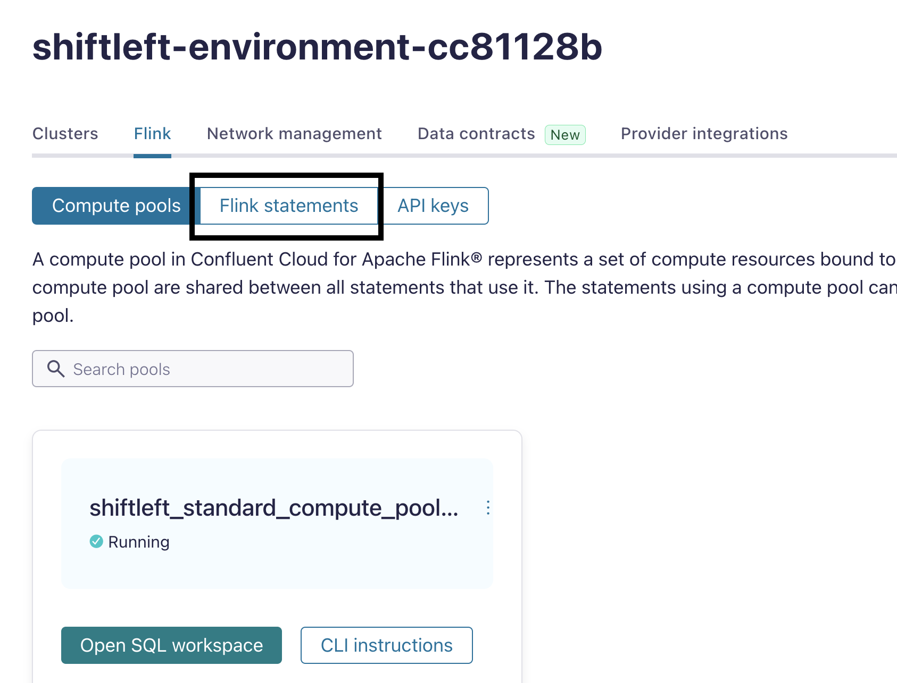
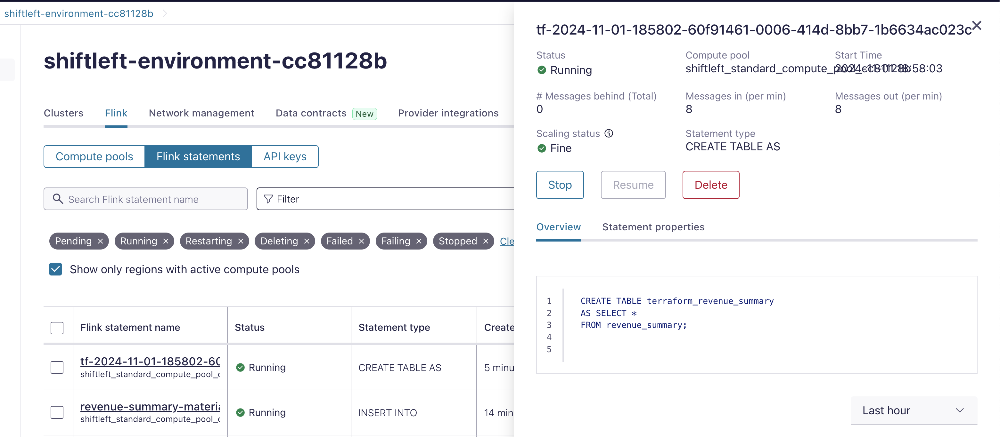
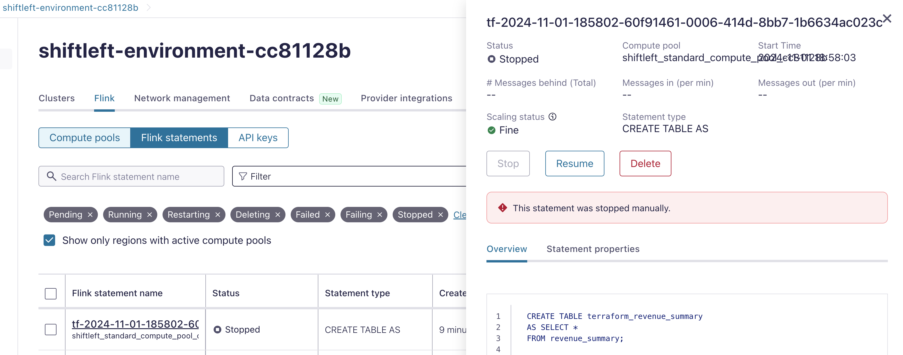

## Managing Data Pipelines

### Monitoring and Visibility

Now let's see how these long-running data pipelines can be monitored. First let's checkout what we have built.

1. In the [Conflluent Cloud Cluster UI](https://confluent.cloud/go/clusters), choose the **Environment** and **Cluster** then click on **Stream Lineage** from the left had pane.
   

2. Click on one of the Flink statements, a new windows will open that shows:
   * The SQL Statement
   * Statement properties
   * Flink metrics to help you monitor the data pipeline - **# Messages behind**, **Messages in (per min)** and **Messages out (per min)** 
  

3. Return to the diagram, and click on an edge to get a description of the flow between the given nodes.
   


### CI/CD for Flink Statements

Up to this point, we’ve been using the Flink UI to create and manage long-running Flink statements. In practice, however, these statements are maintained in a version-controlled Git repository. With Confluent, Flink statements can also be managed through Terraform. In this section, we’ll walk through a quick example.

> NOTE: The previous [parent] terraform script should have created a ```terraform.tfvars``` file for this tutorial

1. Change directory to ```flink_terraform```
   ```
   cd ./Usecase4/flink_terraform
   ```
2. Deploy terraform script
   ```
   terraform init
   terraform apply --auto-approve
   ```
   The script will deploy one CTAS statement. That copies all data from ```revenue_summary``` to a new table.

3. In Flink UI, click on **Flink Statements** 
   

4. Verify that the new statement is created and running. The statement name should start with ```tf_```
   
5. Now edit the ```terraform.tfvars``` file, and change the ```flink_statement_stopped``` to ```true```. Save the file.
6.  re-deploy terraform script
   ```
   terraform apply --auto-approve
   ```
   >NOTE: This will throw an error but the statement is now stopped

7. In Flink UI refresh the page to verify that the CTAS statement is stopped.
   
   

8. **Make sure you destroy this terraform deployement before proceeding to demo clean-up**:
   ```
   terraform destroy --auto-approve
   ```
   > NOTE: Terraform destroy will delete the statement but not the underlying topic.


## Topics

**Next topic:** [Cleanup](../README.md#clean-up)

**Previous topic:** [Usecase 3 - Daily Sales Trends](../Usecase3/USECASE3-README.md)


